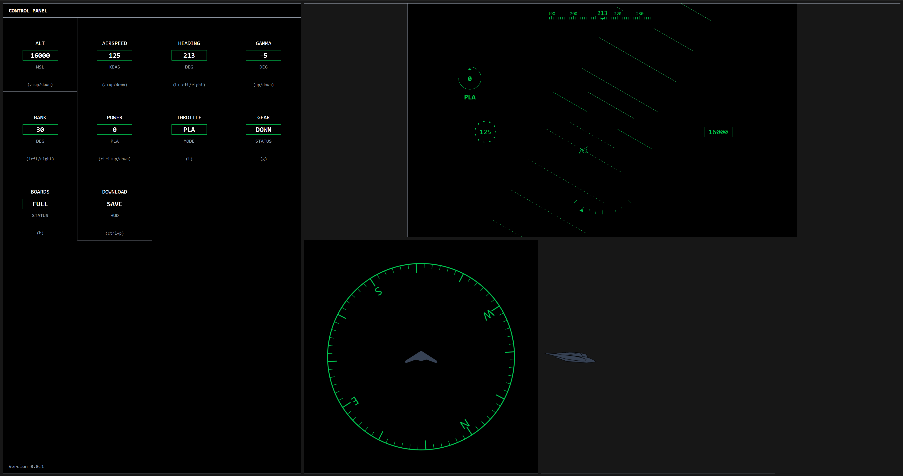

# HUD Builder

- This is a tool designed to help build HUD graphics.
- Hosted version: https://hud-builder.vercel.app/
- Stand-alone version: 
-- Download the latest version of the index.html file in the dist directory
-- Chrome is recommended

# Resources

- https://yqnn.github.io/svg-path-editor/